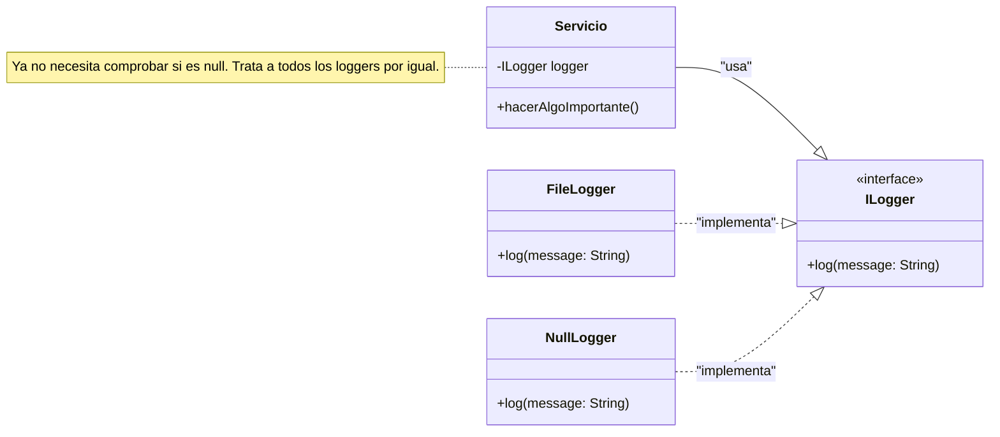

```mermaid
classDiagram
    direction LR

    class Servicio {
        -ILogger logger
        +hacerAlgoImportante()
    }

    class ILogger {
        <<interface>>
        +log(message: String)
    }

    class FileLogger {
        +log(message: String)
    }

    class NullLogger {
        +log(message: String)
    }

    Servicio --|> ILogger : "usa"
    FileLogger ..|> ILogger : "implementa"
    NullLogger ..|> ILogger : "implementa"

    note for Servicio "Ya no necesita comprobar si es null. Trata a todos los loggers por igual."

```