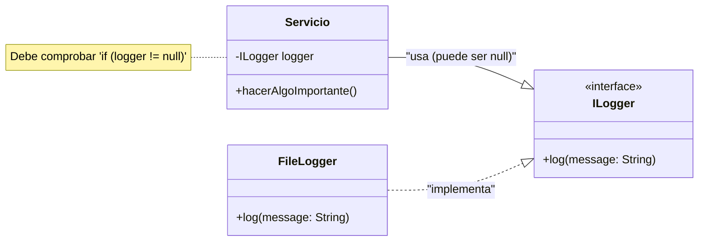

```mermaid
classDiagram
    direction LR
    
    class Servicio {
        -ILogger logger
        +hacerAlgoImportante()
    }
    
    class ILogger {
        <<interface>>
        +log(message: String)
    }
    
    class FileLogger {
        +log(message: String)
    }

    Servicio --|> ILogger : "usa (puede ser null)"
    FileLogger ..|> ILogger : "implementa"

    note for Servicio "Debe comprobar 'if (logger != null)'"
```
